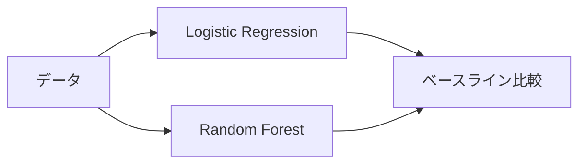

# 🧠 Playground Series S5E7 - Predict the Introverts from the Extroverts

<div align="center">


**個人の性格特性データから内向型・外向型を予測する機械学習コンペティション**

[📊 Competition Page](https://www.kaggle.com/competitions/playground-series-s5e7) • [🚀 Quick Start](#-クイックスタート) • [📈 Results](#-結果)

</div>

---

## 📋 コンペティション概要

<table>
<tr>
<td><b>🏆 コンペ名</b></td>
<td>Predict the Introverts from the Extroverts</td>
</tr>
<tr>
<td><b>📝 シリーズ</b></td>
<td>Playground Series - Season 5, Episode 7</td>
</tr>
<tr>
<td><b>🎯 問題設定</b></td>
<td>人格特性データに基づいて内向型(Introvert)か外向型(Extrovert)かを予測する二項分類問題</td>
</tr>
<tr>
<td><b>📊 評価指標</b></td>
<td>Accuracy（予測精度）</td>
</tr>
<tr>
<td><b>📈 データセット</b></td>
<td>人格特性・行動パターンに関する特徴量</td>
</tr>
</table>

### 🎯 目標
個人の行動パターンや性格特性のデータから、その人が**内向型**か**外向型**かを機械学習で予測すること。

---

## 📊 データセット構成

```
📂 data/
├── 📄 train.csv              # 学習用データ（目的変数あり）
├── 📄 test.csv               # テスト用データ（目的変数なし）
└── 📄 sample_submission.csv  # 提出ファイルのサンプル
```

### 🔍 主要な特徴量（推定）

| カテゴリ | 内容 | 説明 |
|----------|------|------|
| 🎭 **行動パターン** | 日常の行動傾向 | 社交的な活動への参加頻度など |
| 🤝 **社交性指標** | 人との関わり方 | グループ活動 vs 個人活動の選好 |
| 💬 **コミュニケーションスタイル** | 意思疎通の方法 | 積極性、発言頻度、聞き手傾向 |
| 🎪 **活動傾向・選好** | 好みの活動タイプ | エネルギッシュ vs 静的な活動 |

---

## 🚀 アプローチ戦略

### 🔍 1. データ探索・前処理

<details>
<summary><b>詳細な前処理ステップ</b></summary>

- [ ] **📊 欠損値の確認と処理**
  - 欠損パターンの分析
  - 適切な補完方法の選択
  
- [ ] **📈 データ分布の可視化**
  - ヒストグラム、箱ひげ図による分布確認
  - ターゲット変数のバランス確認
  
- [ ] **🎯 外れ値の検出・処理**
  - IQR法、Z-score法による検出
  - 外れ値の処理方針決定
  
- [ ] **🔗 特徴量間の相関分析**
  - 相関行列の作成
  - 多重共線性の確認

</details>

### ⚡ 2. 特徴量エンジニアリング

<details>
<summary><b>特徴量作成戦略</b></summary>

- [ ] **🏷 カテゴリ変数のエンコーディング**
  - Label Encoding
  - One-Hot Encoding
  - Target Encoding
  
- [ ] **📏 数値変数の標準化・正規化**
  - StandardScaler
  - MinMaxScaler
  - RobustScaler
  
- [ ] **🆕 新規特徴量の作成**
  - 特徴量の組み合わせ
  - 統計的特徴量
  - ドメイン知識に基づく特徴量
  
- [ ] **🎯 特徴量選択**
  - 重要度ベース選択
  - 統計的検定
  - 再帰的特徴量削除

</details>

### 🤖 3. モデリング

#### 📊 ベースライン戦略


<details>
<summary><b>モデル選択戦略</b></summary>

- [ ] **🔤 ベースラインモデル**
  - Logistic Regression
  - 解釈しやすく高速
  
- [ ] **🌳 ツリー系モデル**
  - Random Forest
  - XGBoost
  - LightGBM
  
- [ ] **🧠 ニューラルネットワーク**
  - 深層学習アプローチ
  - 複雑なパターン学習
  
- [ ] **🎯 アンサンブル手法**
  - Voting Classifier
  - Stacking
  - Blending

</details>

### 📈 4. モデル評価・改善

<details>
<summary><b>評価・最適化プロセス</b></summary>

- [ ] **✅ 交差検証による性能評価**
  - StratifiedKFold
  - 時系列考慮（必要に応じて）
  
- [ ] **🔧 ハイパーパラメータ調整**
  - Grid Search
  - Random Search
  - Bayesian Optimization
  
- [ ] **📊 特徴量重要度の分析**
  - SHAP値
  - Permutation Importance
  
- [ ] **🔍 モデル解釈性の向上**
  - LIME
  - 特徴量の寄与度分析

</details>

---

## 🚀 クイックスタート

### ✅ 前提条件
- [ ] **Python 3.9+** がインストール済み
- [ ] **Git** がインストール済み
- [ ] **Kaggle API** が設定済み

### 📦 セットアップ手順

```bash
# 1️⃣ リポジトリのクローン
git clone https://github.com/YOUR_USERNAME/kaggle-playground-s5e7.git
cd kaggle-playground-s5e7

# 2️⃣ 仮想環境の作成
python -m venv venv
source venv/bin/activate  # Windows: venv\Scripts\activate

# 3️⃣ 依存関係のインストール
pip install -r requirements.txt

# 4️⃣ データのダウンロード
kaggle competitions download -c playground-series-s5e7
unzip playground-series-s5e7.zip -d data/raw/
```

---

## 📁 プロジェクト構成

<details>
<summary>🗂 <b>フォルダ構成を表示</b></summary>

```
📦 kaggle-playground-s5e7/
├── 📂 data/
│   ├── 📂 raw/                     # 🔒 元データ
│   ├── 📂 processed/               # ⚙️ 前処理済み
│   └── 📂 external/                # 🌐 外部データ
├── 📂 notebooks/
│   ├── 📓 01_eda.ipynb            # 🔍 探索的データ分析
│   ├── 📓 02_preprocessing.ipynb   # 🧹 データ前処理
│   ├── 📓 03_modeling.ipynb       # 🤖 モデル構築
│   └── 📓 04_ensemble.ipynb       # 🎯 アンサンブル
├── 📂 src/
│   ├── 📄 data_preprocessing.py    # 🛠 前処理関数
│   ├── 📄 feature_engineering.py  # ⚡ 特徴量エンジニアリング
│   ├── 📄 models.py               # 🧠 モデル定義
│   └── 📄 utils.py                # 🔧 ユーティリティ
├── 📂 scripts/
│   ├── 📄 train.py                # 🏃‍♂️ 学習スクリプト
│   ├── 📄 predict.py              # 🔮 予測スクリプト
│   └── 📄 create_submission.py    # 📤 提出ファイル作成
├── 📂 submissions/                 # 📋 提出ファイル
├── 📂 models/                     # 💾 学習済みモデル
└── 📂 experiments/                # 📊 実験記録
```

</details>

---

## 📈 結果

### 🏆 現在の成績
| 指標 | スコア | 順位 | 備考 |
|------|--------|------|------|
| **CV Score** | `TBD` | - | 5-Fold Cross Validation |
| **Public LB** | `TBD` | `TBD` | Public Leaderboard |
| **Private LB** | `TBD` | `TBD` | Private Leaderboard |

### 📊 実験履歴
| 実験ID | モデル | 特徴量 | CV Score | Public LB | 備考 |
|--------|--------|--------|----------|-----------|------|
| `exp_001` | Logistic Regression | ベースライン | - | - | 初期ベースライン |
| `exp_002` | Random Forest | 基本特徴量 | - | - | ツリー系ベースライン |
| `exp_003` | XGBoost | 特徴量エンジニアリング後 | - | - | 勾配ブースティング |

---

## 🔧 使用方法

### 🏃‍♂️ 学習の実行
```bash
# 基本的な学習
python scripts/train.py --model xgboost

# ハイパーパラメータ最適化付き
python scripts/train.py --model lightgbm --optimize

# 交差検証の設定
python scripts/train.py --model ensemble --cv 10
```

### 🔮 予測の実行
```bash
# 予測の実行
python scripts/predict.py --model best_model

# 提出ファイルの作成
python scripts/create_submission.py
```

---

## 💡 重要な洞察

### 🔍 データの特徴
- **データバランス**: 内向型・外向型の分布を確認中
- **重要特徴量**: 分析中
- **欠損パターン**: 調査中

### 🧠 モデルの洞察
- **最良モデル**: 検証中
- **アンサンブル効果**: 検証中
- **解釈性**: SHAP値による分析実施予定

---

## 📚 参考資料

| リソース | リンク | 説明 |
|----------|------|------|
| 🏆 **コンペページ** | [Kaggle](https://www.kaggle.com/competitions/playground-series-s5e7) | 公式コンペティションページ |
| 📊 **Playground Series** | [Overview](https://www.kaggle.com/competitions/playground-series) | シリーズ概要 |
| 🧠 **MBTI Dataset** | [Kaggle](https://www.kaggle.com/datasets/datasnaek/mbti-type) | 関連する性格データ |
| 📈 **Big Five Test** | [Kaggle](https://www.kaggle.com/datasets/tunguz/big-five-personality-test) | 性格研究データ |

---

## 🤝 コントリビューション

プロジェクトへの貢献を歓迎します！

### 📝 開発ガイドライン
1. **ブランチ命名**: `feature/説明` または `fix/説明`
2. **コミットメッセージ**: [Conventional Commits](https://conventionalcommits.org/) に従う
3. **コードスタイル**: PEP 8 に準拠
4. **ドキュメント**: 重要な変更時はREADME更新

### 🔄 ワークフロー
```bash
# 1️⃣ 最新の変更を取得
git pull origin main

# 2️⃣ フィーチャーブランチを作成
git checkout -b feature/your-feature

# 3️⃣ 変更をコミット
git commit -m "feat: 新機能の説明"

# 4️⃣ プッシュしてPR作成
git push origin feature/your-feature
```

---

<div align="center">

## 🏆 Happy Kaggling! 🏆

**個性を予測する機械学習の旅へ出発！**

[](https://www.python.org/)
[](https://www.kaggle.com/competitions/playground-series-s5e7)

**Created by**: [Your Team Name]  
**Date**: 2025年7月  
**Competition**: Playground Series S5E7

</div>